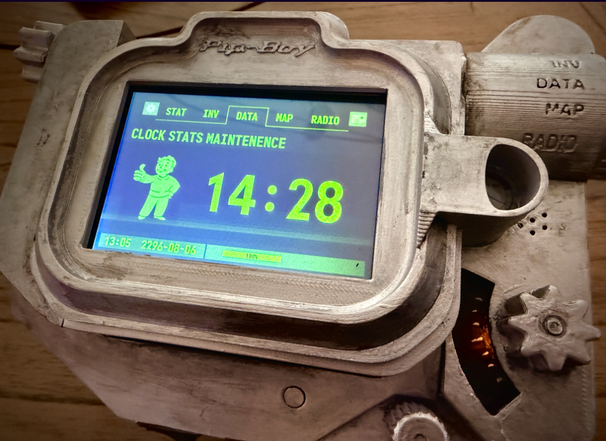
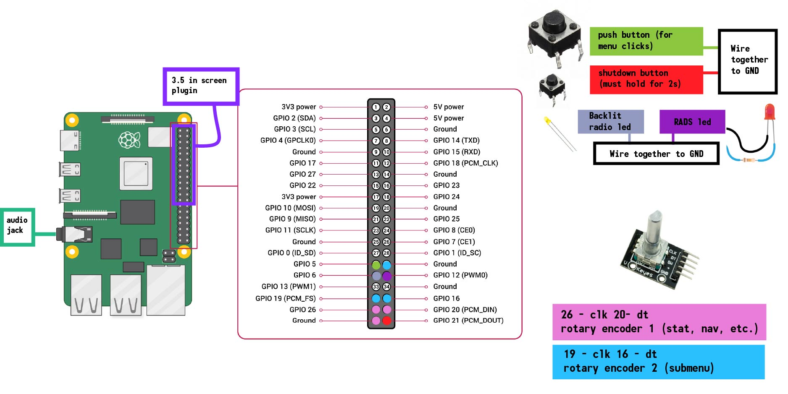
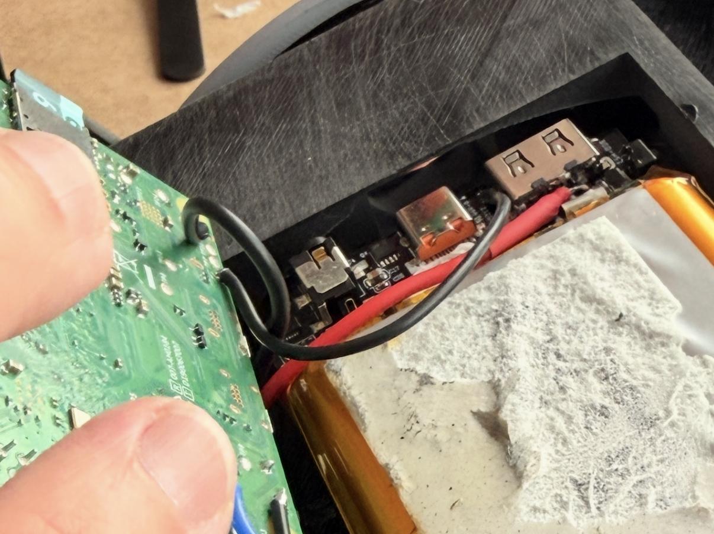
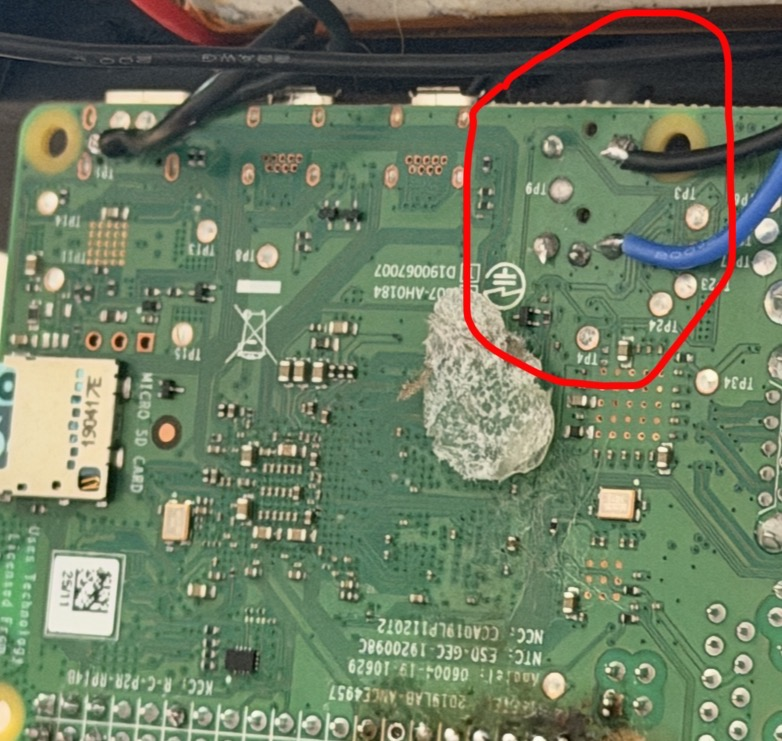

# **Pip-Boy 3000 Mk V**
## Based on the version from the Fallout TV show

## With Raspberry Pi 4 and working Rotary Encoders 

## Materials
- Raspberry Pi 4
- Rotary Encoders
- Red and Yellow LED
- Wires
- 3.5 in Screen for Raspberry Pi
- 2 Push Buttons (One was 10mm and shutdown was 6mm)
- Mini Speakers 
- PAM 8403 Mini Amp
- Battery Pack (Like a portable charger)
- On/Off switch
- 3d printer 
- Soldering equiptment
- Primer and Paint
- Cushion Foam to pad the inside

## Using the code
Dependencies are in requirements.txt

My Pi was on Debian Trixie with Python 3.13.5

To add music, put .wav files in the music folder and they will be in the radio.

To boot up the app on startup:

Create in your project folder:

    # launcher.sh

    cd 
    cd /home/pipboy/Desktop/pipboy-code
    python pipboy.py

Save it, then do:

    nano ~/.config/autostart/pipboy.desktop

then enter:

    [Desktop Entry]
    Type=Application
    Name=Pipboy
    Exec=/home/pipboy/Desktop/pipboy-code/launcher.sh

And save.

Be sure to use your filepath to the code or it wont work.

To make my homepage empty, I used a empty folder as the display for the home screen. I also used the panel preferences to make the bar as small as possible so it wasn't visible.

## Wiring
Here are the pins used in the code(numbers refer to GPIO pins)

5v connections were shared between rotaries

Power was directly soldered to the battery and on/off switch.

The mini amp was wired to the back of the audio jack.

The rotary encoders needed to be trimmed at the top edge in order to fit inside the Pip-Boy.

